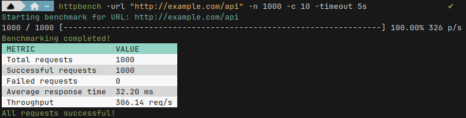

<div align="center">
  <h1>httpbench</h1>
  <p>A powerful command-line tool for benchmarking HTTP endpoints.</p>
</div>

[](https://golang.org)
[](https://github.com/simonlariz/httpbench/blob/main/LICENSE)
[](https://goreportcard.com/report/github.com/simonlariz/httpbench)
[](https://github.com/simonlariz/httpbench/stargazers)

## Table of Contents
- [Demo](#demo)
- [Features](#features)
- [Installation](#installation)
- [Usage](#usage)
- [Example](#example)
- [Customization](#customization)
- [Contributing](#contributing)
- [License](#license)

## Demo


## Features

- 🚀 Send concurrent HTTP requests to a specified URL
- ⚙️ Customize the number of requests, concurrency level, and timeout duration
- 📊 Measure response times and calculate average, minimum, and maximum values
- 📈 Calculate throughput (requests per second)
- 🌈 Display progress bar to track benchmarking progress
- 💅 Generate colorful and formatted output for easy readability

## Installation

To install `httpbench`, make sure you have [Go](https://golang.org) installed on your system. Then, run the following command:

```bash
go get github.com/simonlariz/httpbench
```

Or you can clone the repository and build the binary manually:

```bash
git clone https://github.com/SimonLariz/httpbench.git
cd httpbench
go build -o ./bin/httpbench cmd/httpbench/main.go
``` 

Then you can run the binary:

```bash
./bin/httpbench
```

## Usage

To start benchmarking an HTTP endpoint, run the following command:

```bash
httpbench -url "http://example.com/api" -n 1000 -c 10 -timeout 5s
```

This command sends 1000 requests to `http://example.com/api` with a concurrency level of 10 and a timeout of 5 seconds. You can customize these values based on your requirements.

- `-url`: The URL of the HTTP endpoint to benchmark
- `-n`: The total number of requests to send
- `-c`: The concurrency level (number of requests to send concurrently)
- `-timeout`: The duration to wait for a response from the server

For more information about the available options, run `httpbench -h`.

## Example 



## Customization
`httpbench` provides various customization options for the progress bar and output formatting. You can modify the following properties:

- Progress bar width
- Progress bar template string
- Progress bar fill character
- Progress bar empty character
- Current and total count format
- Progress bar color
- Progress bar refresh rate

Refer to the source code and the `github.com/cheggaaa/pb` package documentation for more details on customization options.

## Important Note

Please refrain from benchmarking, load testing, or performing any unauthorized tests on the live website or application without explicit permission from the project maintainers. Unauthorized testing can put unnecessary strain on the servers and may be considered a form of attack. If you wish to conduct performance tests or benchmarking, please contact us first to discuss the scope and obtain permission. Thank you for your understanding and cooperation.

## Roadmap

- [ ] Support for POST request with request bodies
- [ ] Integration with popular monitoring tools (e.g., Prometheus, Grafana)
- [ ] Web-based dashboard for monitoring and analyzing benchmark results

## Contributing

Contributions are welcome! If you find any issues or have suggestions for improvements, please open an issue or submit a pull request on the GitHub repository.

## License

This project is licensed under the [MIT License](LICENSE).
